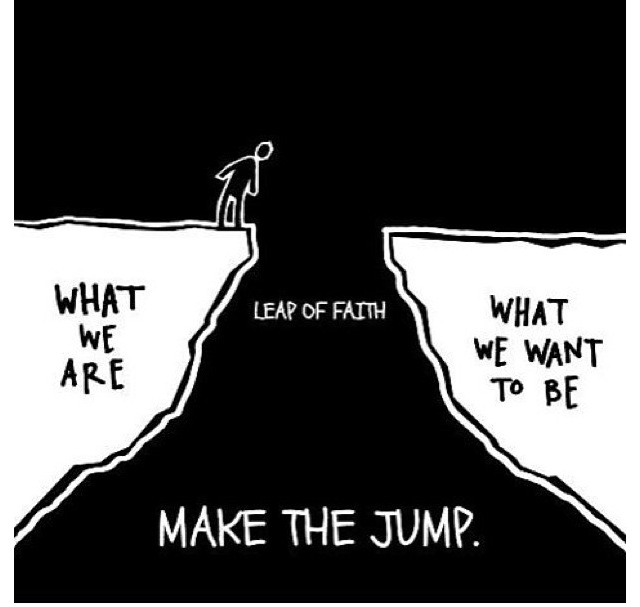
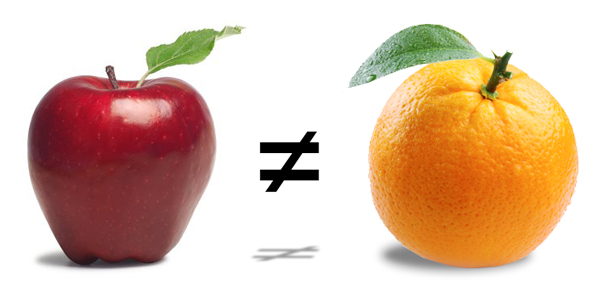
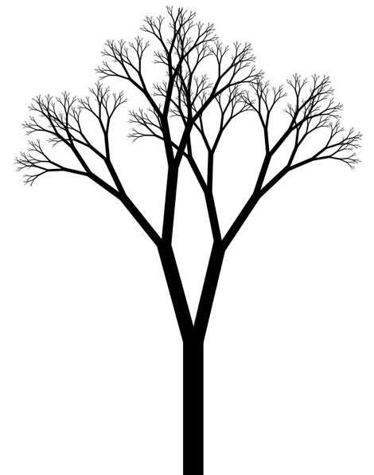
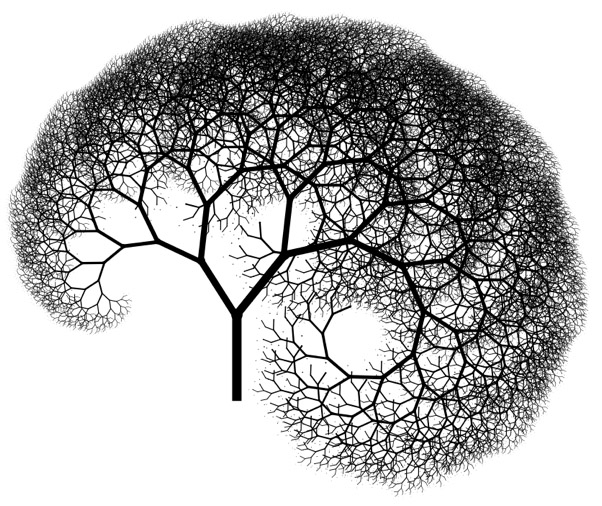

- title : Functional Programming for Tiny Devices
- description : Introduction to functional programming for mobile and other small devices
- author : Kunjan Dalal
- theme : night
- transition : default

***
### Rise of Functional Programming Languages 

- Haskell
- Ocaml
- Erlang
- Scala
- Clojure
- F#

And there is a long list in recent past.

***
### Necessity for cloud and Distributed system

They become `goto` language when it comes to programming for cloud and/or distributed system. 
As it provides features like 

- Immutability
- Higher order functions
- Type System (If we skip few language)
- Pure functions just to count few. 

***

### It's good for Data Processing

    let data = FreebaseData.GetDataContext()
    data.Society.Government.``US Presidents``
    |> Seq.map (fun p ->  p.``President number`` |> Seq.head, p.Name)
    |> Seq.sortBy fst
    |> Seq.iter (fun (n,name) -> printfn "%s was number %i" name n )

Results

    George Washington was number 1
    John Adams was number 2
    Thomas Jefferson was number 3
    James Madison was number 4
    James Monroe was number 5
    John Quincy Adams was number 6
    ...
    Ronald Reagan was number 40
    George H. W. Bush was number 41
    Bill Clinton was number 42
    George W. Bush was number 43
    Barack Obama was number 44

***

### And for Data/Domain Modeling

> You want to register User into system then =>

---

#### Registration Info

    type RegistrationInfo = 
        { Blocked : bool
        Created : System.DateTime
        Updated : System.DateTime }

---   
#### Password
    //In any case encrypted password will come out
    module Password = 
        open Pbkdf2
        
        type EncryptedPassword = 
            private
            | EncryptedPassword of string
        
        let createEncryptedPassword s = 
        let wrapHash input = ok <| strongHash input //No fail case for this. 
        trial { let! a = String50.create s
                let! b = wrapHash <| String50.value a
                return EncryptedPassword b }
        
        let create s = EncryptedPassword s //TODO do not do encryption here. As it is coming from db
        let value (EncryptedPassword e) = e

---

#### UserInfo
    type UserInfo = 
        { Id : int
          UIN : string }

---

#### UserType
    type UserType = 
        | Normal
        | Admin

---

#### Register User

    type RegisteredUser = 
        { Info : UserInfo
        Type : UserType
        Registration : RegistrationType * RegistrationInfo
        Password : Password.EncryptedPassword }

***
### Obviously for Design Pattern

courtesy [Scott Wlaschin](https://twitter.com/ScottWlaschin)

***

### All goodies are available for Smart Devices

***

### We just need to make a jump

***

### Java => Kotlin

    linearLayout {
        button("Login") {
            textSize = 26f
            onClick {
                doSomeStuff()
            }
        }.layoutParams(width = wrapContent) {
            horizontalMargin = dip(5)
            topMargin = dip(10)
        }
    }
    
    async {
        doSomeWork() // Long background task
        uiThread {
            result.text = "Done"
        }
    }

***

### Objective C => Swift
    public func tableView(tableView: UITableView, numberOfRowsInSection section: Int) -> Int
    public func tableView(tableView: UITableView, cellForRowAtIndexPath indexPath: NSIndexPath) -> UITableViewCell
    
    func tableView(tableView: UITableView, numberOfRowsInSection section:    Int) -> Int {
        return 10
    }
    func tableView(tableView: UITableView, cellForRowAtIndexPath indexPath: NSIndexPath) -> UITableViewCell {
        let cell: UITableViewCell = UITableViewCell(style: UITableViewCellStyle.Subtitle, reuseIdentifier: "MyTestCell")
        
        cell.textLabel?.text = "Row #\(indexPath.row)"
        cell.detailTextLabel?.text = "Subtitle #\(indexPath.row)"
        
        return cell
    }

***

### C# => F#

    //Sample android code
    override this.OnCreate (bundle) =
            let metrics = new DisplayMetrics()
            this.WindowManager.DefaultDisplay.GetMetrics (metrics)
            Images.ScreenWidth <- float32 metrics.WidthPixels
            FileCache.saveLocation <- this.CacheDir.AbsolutePath
            base.OnCreate (bundle)
            this.SetContentView (Resource_Layout.Main)

            if this.FragmentManager.BackStackEntryCount = 0 then
                let productFragment = new ProductListFragment (ProductSelected = this.ShowProductDetail)
                baseFragment <- productFragment.Id
                this.SwitchScreens (productFragment, false, true)
 
***

### Let's compare Apple with Ornges

 

---
#### Java Code

    public class MainActivity extends Activity {

        int count = 0;
        @Override
        protected void onCreate(Bundle savedInstanceState) {
            super.onCreate(savedInstanceState);
            setContentView(R.layout.activity_main);
            setEvents();
        }

        private void setEvents() {
            final Button mybutton = (Button) this.findViewById(R.id.myButton);
            mybutton.setOnClickListener(new OnClickListener() {

                @Override
                public void onClick(View v) {
                    // TODO Auto-generated method stub
                    mybutton.setText(String.valueOf(count));
                }
            });

            final TextView seekbarView = (TextView) this.findViewById(R.id.seekbarTextView);
            SeekBar seekbar = (SeekBar) this.findViewById(R.id.seekBar1);
            seekbar.setOnSeekBarChangeListener(new OnSeekBarChangeListener() {
                int progresssed = 0;
                @Override
                public void onStopTrackingTouch(SeekBar seekBar) {
                    // TODO Auto-generated method stub
                    seekbarView.setText(String.valueOf(progresssed));
                }

                @Override
                public void onStartTrackingTouch(SeekBar seekBar) {
                    // TODO Auto-generated method stub

                }

                @Override
                public void onProgressChanged(SeekBar seekBar, int progress,
                        boolean fromUser) {
                    // TODO Auto-generated method stub
                    progresssed = progress;
                }
            });

            CheckBox checkbox = (CheckBox) this.findViewById(R.id.checkBox1);
            checkbox.setOnCheckedChangeListener(new OnCheckedChangeListener() {

                @Override
                public void onCheckedChanged(CompoundButton buttonView, boolean isChecked) {
                    // TODO Auto-generated method stub
                    Log.i("info","Checkbox is " + String.valueOf(isChecked));
                }
            });
        }
    }
---

#### C# Code

    [Activity (Label = "XamarinBlog", MainLauncher = true, Icon = "@drawable/icon")]
        public class MainActivity : Activity
        {
            int count = 1;

            protected override void OnCreate (Bundle bundle)
            {
                base.OnCreate (bundle);

                // Set our view from the "main" layout resource
                SetContentView (Resource.Layout.Main);
                var button = this.FindViewById<Button> (Resource.Id.myButton);
                button.Click += (sender, e) => {
                    button.Text = String.Format("{0} clicks",count);
                    count++;
                };

                var seekbarTextView = this.FindViewById<TextView> (Resource.Id.seekbarTextView);
                var seekbar = this.FindViewById<SeekBar> (Resource.Id.seekBar1);
                seekbar.ProgressChanged += (sender, e) => {
                    seekbarTextView.Text = String.Format("The value of seekbar is {0}", e.Progress);
                };

                var checkbox = this.FindViewById<CheckBox> (Resource.Id.checkBox1);

                checkbox.CheckedChange += (sender, e) => {
                    Console.WriteLine("Checked changed!");
                };
            }
        }

---

#### F# Code

    [<Activity(Label = "XamarinBlog", MainLauncher = true)>]
    type MainActivity() = 
        inherit Activity()
        let mutable count : int = 1
        override this.OnCreate(bundle) = 
            base.OnCreate(bundle)
            // Set our view from the "main" layout resource
            this.SetContentView(Resource_Layout.Main)
            // Get our button from the layout resource, and attach an event to it
            let button = this.FindViewById<Button>(Resource_Id.myButton)
            button.Click.Add(fun args -> 
                button.Text <- sprintf "%d clicks!" count
                count <- count + 1)
            let seekbarTextView = this.FindViewById<TextView>(Resource_Id.seekbarTextView)
            let seekbar = this.FindViewById<SeekBar>(Resource_Id.seekBar1)
            seekbar.ProgressChanged.Add
                (fun args -> seekbarTextView.Text <- sprintf "The value of seekbar is %A" args.Progress)

            let checkbox = this.FindViewById<CheckBox>(Resource_Id.checkBox1)
            checkbox.CheckedChange.Add(fun args -> printfn "Check changed")

***

### Xamarin Love Story

> Miguel de Icaza, best known for starting the GNOME, Mono, and Xamarin projects, had few things to say about F#

---

> **Q:** What do you think of F# -- and what is it's future? "Just" a testing ground for functional features that eventually show up in C# -- or something much more?

---
> **A:** I really enjoy F# personally.It saves a lot of typing, it is very convenient, and like Lisp, I have noticed that I tend to very quickly break up code into smaller functions. I do not know what the psychological reason for this is, but it just is. I do miss my braces, and I do miss my C-based control flow on F#, but I do love it very much. There is an interesting phenomenon happening at Xamarin. Whenever one of our engineers starts working with F#, they tend to embrace it and stay there. I am also very happy that the best features of F# are showing up in C# and both are constantly evolving.

--- 

> **Q:** If you were starting out now in your career what language would you learn?

---

> **A:** F#, but C# is a good close second.

***

### Fun Courtesy

> [Rachel Reese](http://rachelree.se/) made a minesweeper complety in F# for [iOS](https://github.com/rachelreese/Minesweeper/).

*** 

### Even Smaller Devices

***

### Questions

> For this Section

*** 
### Workshop

> We will be making some trees 

---

** Either **

---

** Or **

*** 
### Let's get started
> ???

---
    open System
    open System.Drawing
    open System.Windows.Forms
---
    // Create a form to display the graphics
    let width, height = 500, 500         
    let form = new Form(Width = width, Height = height)
    let box = new PictureBox(BackColor = Color.White, Dock = DockStyle.Fill)
    let image = new Bitmap(width, height)
    let graphics = Graphics.FromImage(image)
    //The following line produces higher quality images, 
    //at the expense of speed. Uncomment it if you want
    //more beautiful images, even if it's slower.
    //Thanks to https://twitter.com/AlexKozhemiakin for the tip!
    //graphics.SmoothingMode <- System.Drawing.Drawing2D.SmoothingMode.HighQuality
    let brush = new SolidBrush(Color.FromArgb(0, 0, 0))
---
    box.Image <- image
    form.Controls.Add(box) 

    // Compute the endpoint of a line
    // starting at x, y, going at a certain angle
    // for a certain length. 
    let endpoint x y angle length =
        x + length * cos angle,
        y + length * sin angle

    let flip x = (float)height - x
---
    // Utility function: draw a line of given width, 
    // starting from x, y
    // going at a certain angle, for a certain length.
    let drawLine (target : Graphics) (brush : Brush) 
                (x : float) (y : float) 
                (angle : float) (length : float) (width : float) =
        let x_end, y_end = endpoint x y angle length
        let origin = new PointF((single)x, (single)(y |> flip))
        let destination = new PointF((single)x_end, (single)(y_end |> flip))
        let pen = new Pen(brush, (single)width)
        target.DrawLine(pen, origin, destination)

    let draw x y angle length width = 
        drawLine graphics brush x y angle length width
---
    let pi = Math.PI

    // Now... your turn to draw
    // The trunk
    draw 250. 50. (pi*(0.5)) 100. 4.
    let x, y = endpoint 250. 50. (pi*(0.5)) 100.
    // first and second branches
    draw x y (pi*(0.5 + 0.3)) 50. 2.
    draw x y (pi*(0.5 - 0.4)) 50. 2.

    form.ShowDialog()

    (* To do a nice fractal tree, using recursion is
    probably a good idea. The following link might
    come in handy if you have never used recursion in F#:
    http://en.wikibooks.org/wiki/F_Sharp_Programming/Recursion

    *)

***

### Thank You

I like to Thank

- You people tolarating me 
- Thought Works for hosting this
- Shirish and Team for helping us out
- #fsharp community without them this can't be possible

*Wait* there is more

***

### FSharp TV

[Fsharp TV](https://fsharp.tv/) team is happy to give **one** coupen for [Machine Learning course](https://www.udemy.com/fsharp-programming/) to again *one* lucky winner.

> Thanks Mark for this. 

***

###  References

- [FSharp.org](http://fsharp.org/)
- [FSharp.tv](https://fsharp.tv/)
- [fhsarpforfunandprofit by Scott Wlaschin](https://fsharpforfunandprofit.com/)
- [Functional Principles for Object Oriented Development by Jessica Kerr](https://www.youtube.com/watch?v=pMGY9ViIGNU)
- [FSharp Conference](http://fsharpconf.com/) 

***

- QnA?
- Suggestions?

---

#### You can always Contact Me

- Twitter - [@kunjee](https://twitter.com/kunjee)
- WebSite - [kunjan.in](http://kunjan.in)